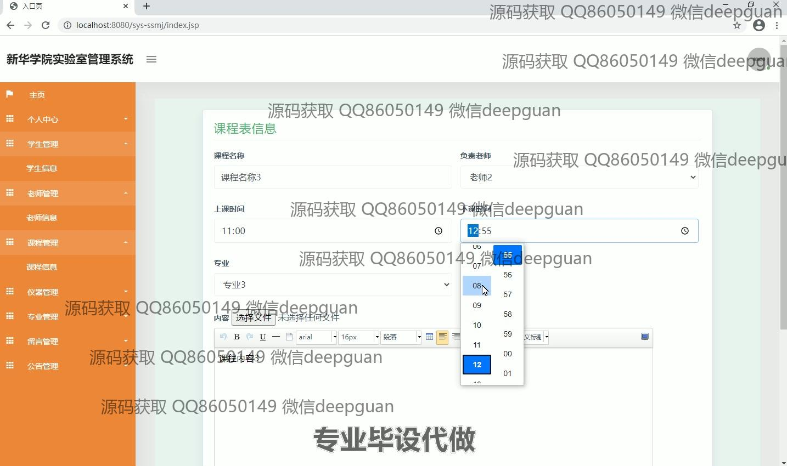
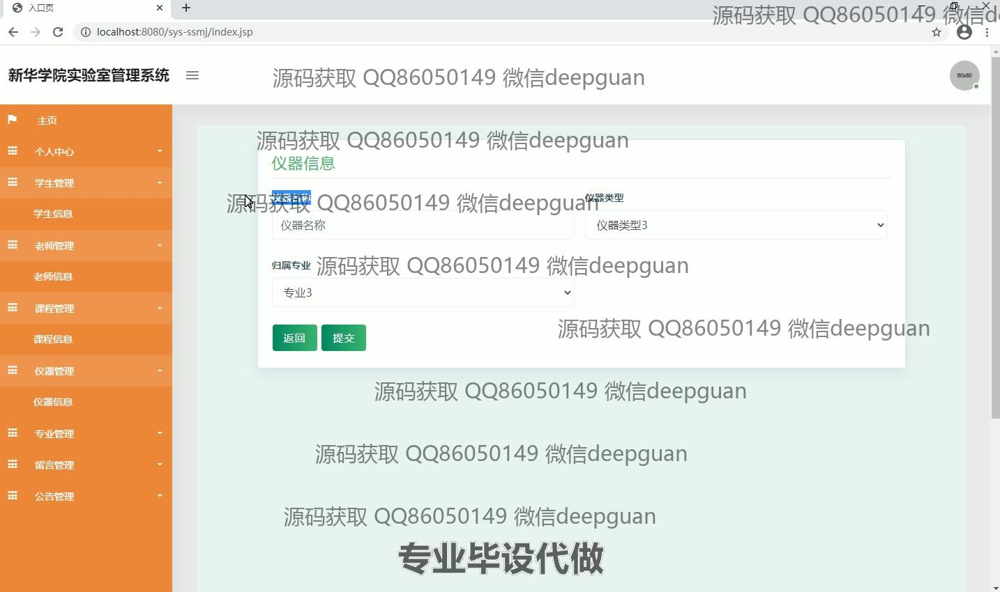
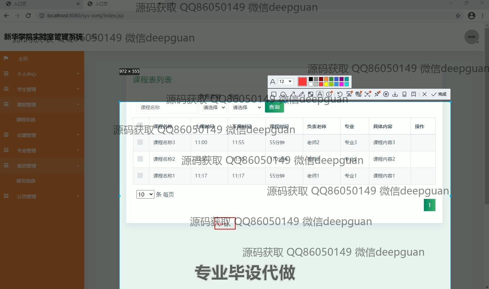

<h1 align="center">安徽新华学院实验中心管理系统的设计与实现</h1>

## 简介
安徽新华学院实验中心管理系统：实现从学生管理、教师及课程管理到设备与留言管理的多模块功能，支持密码修改、课程安排和专业管理，界面设计简洁，便捷高效提升实验室管理。    --计算机毕业设计源码；毕设源码；java毕业设计源码

## 联系方式

<h3 align="center">获取完整代码与数据库文件 + 微信：deepguan QQ: 86050149 QQ群: 783742310</h3>

<h3 align="center">可帮忙远程部署 包运行成功！提供远程部署、修改代码、设计文档指导、代码讲解等服务！</h3>

## 功能介绍（完整见运行截图）
管理员：登录、注册、退出功能；管理学生、教师、课程、仪器、专业、留言、公告等信息模块；支持学生信息添加、编辑及批量管理；课程管理包括课程时间设置、负责教师分配及筛选查询；仪器管理支持仪器信息录入、查询、修改、删除及批量操作；专业管理提供专业信息编辑、批量删除及新增功能；留言管理支持查看、回复、删除和批量处理；公告管理用于发布与更新系统通知。

教师：登录、注册、退出功能；课程信息管理，包括课程时间设置、内容编辑及相关文件上传；支持课程查询及编辑；个人信息查看与修改；教学相关资源管理及上传；参与系统公告与留言交互，处理学生相关问题反馈。

学生：登录、注册、退出功能；个人中心查看与更新基本信息；查看课程安排与课程内容；支持实验室预约、查询实验信息及提交预约申请；参与系统留言功能，向教师或管理员反馈问题。

访客：登录注册页访问权限；可根据角色选择身份（管理员、教师或学生）；登录后访问特定功能模块；未登录状态只能浏览系统登录界面和基本欢迎信息。

## 运行截图

本代码来源于网络,仅供学习参考使用!

